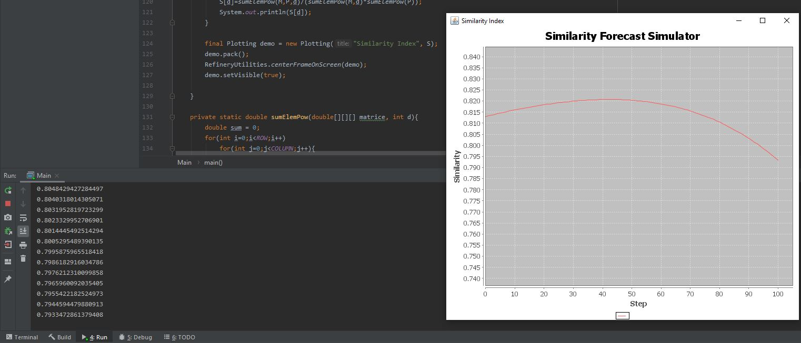

Cristian Neagu 1240F

An implementation after Paul A. Gagniuc et al. Spectral Forecast: A general purpose prediction model as an alternative to classical neural networks.  Chaos 30, 033119 (2020); doi: 10.1063/1.5120818 
https://aip.scitation.org/doi/pdf/10.1063/1.5120818

